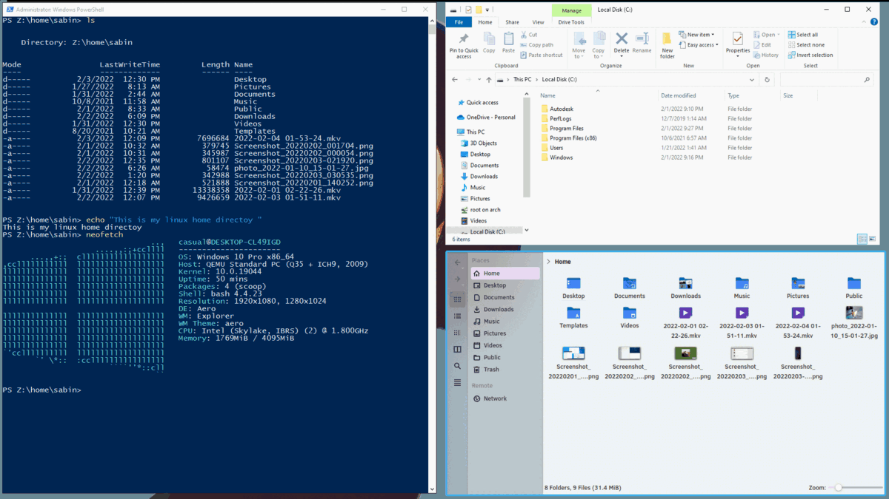

#   Cassowary

[](https://github.com/casualsnek)



With Cassowary you can run a Windows virtual machine and use Windows applications on Linux as if they were native applications, built upon FreeRDP and remote apps technology.

**If you prefer a setup guide video instead of a wall of text, [click here.](https://www.youtube.com/watch?v=ftq-c_VgmK0)**

Please give a star ⭐ or follow this project if you find it useful.

## Cassowary supports:

- Running Windows application as if they were native application
- Opening files from a Linux host directly inside Windows applications
- Using Linux apps to open files that are on a Windows VM
- Allowing easy access between both the guest and host filesystems
- An easy-to-use configuration utility
- Creating an application launcher for Windows application
- Automatically suspending the VM when no Windows application is in use and automatically resume it when required (virt-manager only)

## This README consists of instructions for:

1. [Setting up a Windows VM with virt-manager](docs/1-virt-manager.md)
2. [Installing Cassowary on a Windows guest and Linux host](docs/2-cassowary-install.md)
3. [Extra How to's and FAQ](docs/3-faq.md)
* Building Cassowary from source
* How can I help?

<br>

## Building Cassowary from source

This step is ONLY necessary if you don't want to use the releases from the [release page](https://github.com/casualsnek/cassowary/releases) and you want to build the `.zip` and the `.whl` files by yourself!

#### Building linux application (on Linux)

```bash
$ git clone https://github.com/casualsnek/cassowary
$ cd cassowary/app-linux
$ chmod +x build.sh
$ ./build.sh
```

This will create a directory named `dist` inside `app-linux` directory containing installable `.whl` file

#### Building windows application ( on Windows )

Download and install [Python3](https://python.org) (If on Windows 7 use Python 3.7) and [Git](https://git-scm.com) on the Windows system then run the commands:

```bash
$ git clone https://github.com/casualsnek/cassowary
$ cd cassowary\app-win
$ .\build.bat
```

This will create a directory named `bin` containing the setup files. 

#### Building both linux and windows applications on Linux

Install [wine](https://wiki.winehq.org/Download) first, in order to build Windows application on Linux. Internet access is required to download the python binary for setup. 
Note that Windows application built through wine may fail to run properly on some Windows systems.

```bash
$ git clone https://github.com/casualsnek/cassowary
$ cd cassowary
$ chmod +x buildall.sh
$ ./buildall.sh
```

This will create a `dist` folder inside `app-linux` which contains the installable wheel file.  
A `bin` folder will also be created inside `app-win` containing the setup files for Windows.

<br>

## How can I help?

- Improve the README.md and/or the documentation
- Report bugs or submit patches
- Suggest new features or improvements on existing ones!
